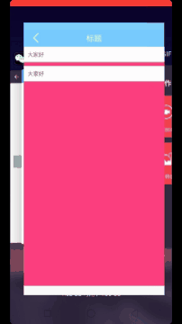

自定义控件学习
======

## 高仿QQ侧滑item空间:2018.3.28

 

## 描述

-　SideslipMenuLayout类

-　PointF使用记录每次按下的点，记录每次滑动的时候更换的点

> case MotionEvent.ACTION_DOWN:
>                // 设置按下的的 x y 位置，记录起来
>                mFirstPointF.set(ev.getRawX(), ev.getRawY());
>                mLastPointF.set(ev.getRawX(), ev.getRawY());
>                if (mSideslipMenuLayout != null) {
>                    mSideslipMenuLayout.closeAnimator();
>                }
>                break;
>
>            case MotionEvent.ACTION_MOVE:
>
>                float RelativeMove = mLastPointF.x - ev.getRawX(); // 相对移动的距离
>
>                scrollBy((int) RelativeMove, 0); // 平滑的移动
>
>                mLastPointF.set(ev.getRawX(), ev.getRawY());
>
>                // 判断移动的距离是否越界，以 left = 0 ,right = 屏幕宽为临界值
>                if (getScrollX() < 0) {
>                    scrollTo(0, 0);
>                }
>
>                if (getScrollX() > rightMoveMaxLength) {
>                    scrollTo(rightMoveMaxLength, 0); // 设置 getScrollX 最大值是 rightMoveMaxLength
>                }
>
>                break;

